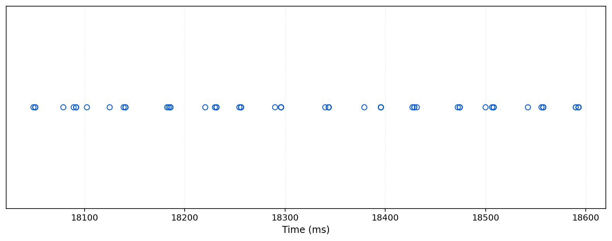

# PEMI: Transparent Performance Enhancements for QUIC

## Key Insight

PEMI runs on middleboxes and infers QUIC losses to provide fast retransmissions. This is normally impossible because QUIC encrypts both packet numbers and ACK frames. PEMI’s key insight is that many network traffic exhibits locality: packets naturally form flowlets. By leveraging this locality, PEMI can narrow down the set of sent packets that a returning packet most likely corresponds to, and then detect losses.

Such locality is very common in real traffic. Below are timing plots of server-sent packets from the largest QUIC flow in two example cases:

- Accessing a webpage on https://sourceforge.net
    

- Watching the live media demo on https://moq.dev/ (a short slice)
    

You can see that the transmitted packets form a series of small packet bursts (flowlets in PEMI), with clear gaps (milliseconds to hundreds of milliseconds in the above two cases) between them.
When these gaps are large enough, a middlebox can more easily match the receiver’s returning packets to a small region of sent packets (most likely the packets that triggered those returns), enabling further inference.

## Repository Overview

Our artifact includes the following directories:

#### pemi/
- Prototype implementation of PEMI

#### apps/
- [ ] Example applications.

#### mininet/
- [ ] Mininet-based testbed to evaluate PEMI under various network conditions.
- [ ] Mahimahi(CellReplay and LeoReplayer) integrated for realistic network emulation.

#### tools/
Utilities to get:
- [ ] 1. Traces from the perspective of middle-boxes
- [ ] 2. Ground truth of packet loss and timestamps of packets reached the each hop(sender, middle-boxes, receiver)

## Dependencies

We test our code on Ubuntu 22.04.
The following dependencies need to be installed, required for different components:

```bash
sudo apt-get install -y mininet python3-pip  # mininet
sudo apt-get install -y autoconf libtool  # curl
sudo apt-get install -y cmake libpcre3 libpcre3-dev zlib1g zlib1g-dev libssl-dev  # nginx
sudo apt-get install -y libnfnetlink-dev  # pepsal
```

To enable TCP traffic enhancement via `--pep` when running `mininet/run.py`, you need to install `pepsal`. See: https://github.com/CNES/pepsal.git.
The quiche-based nginx and curl installation scripts are in `apps/http/`.