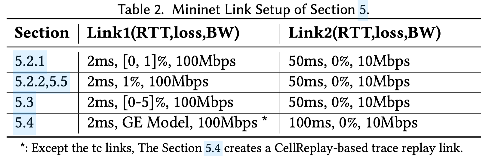
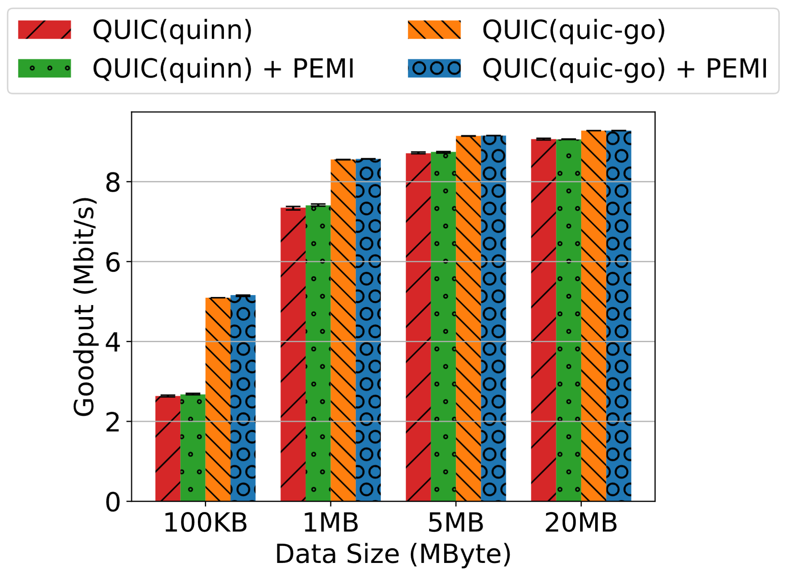
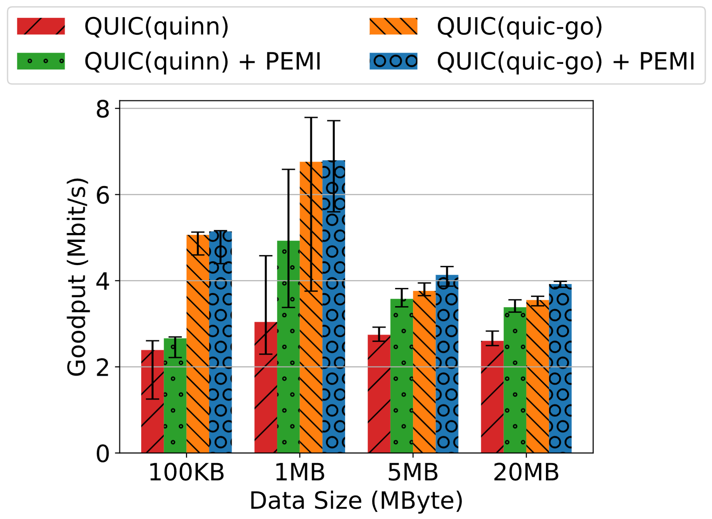
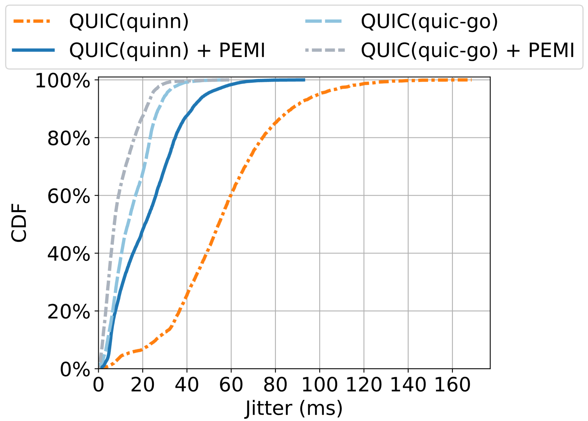
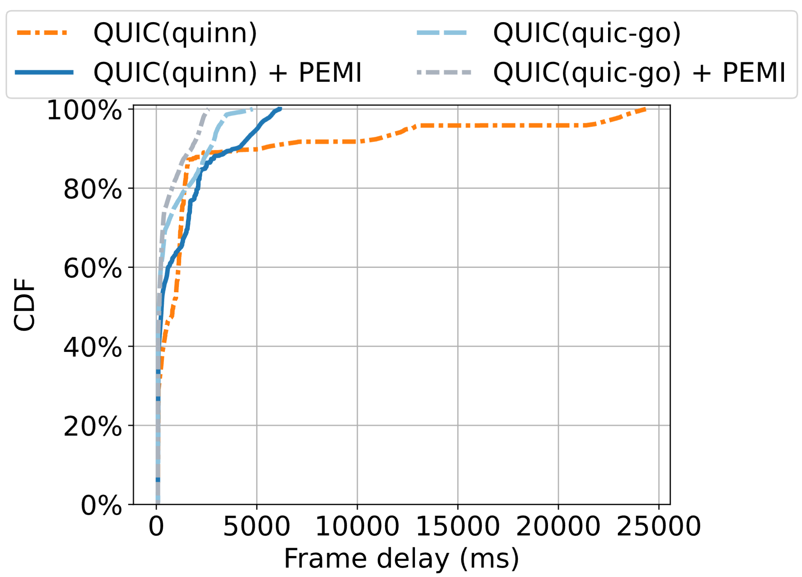
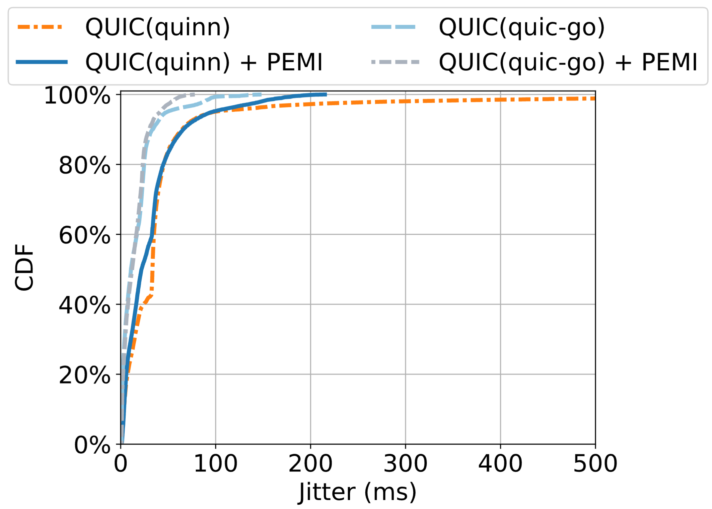

## Applications

1. **File transfer**:  
   Since we cannot test quinn/quic-go using nginx and curl as we did with quiche, we implemented simple quinn-based/quic-go-based data-transfer applications to measure goodput.

2. **RTC frames**:  
   Similar to the quiche evaluations, we implemented dummy RTC applications that send frames.

The applications can be found in the `apps/` directory.

## Experimental Settings

The goodput test follows the same settings as Section 5.2.1 of the manuscript (under review);  
the RTC test follows Section 5.2.2;  
the cellular-trace-based test follows Section 5.4.  
The corresponding settings are as follows:

## Goodput Test

Each experiment was repeated 10 times. Results are as follows:

- **loss1 = 0%**: enabling PEMI barely affects goodput.

  

- **loss1 = 1%**: with PEMI enabled, goodput improves across different file sizes. The maximum improvement for quinn is 62.0% for an 1 MB flow size.
For quic-go, the maximum improvement is 10.5% for a 20 MB flow size.

  

---

## RTC Test

Each experiment ran for 20 seconds and was repeated 10 times.

1. **Frame delay**: after enabling PEMI, the frame delay is significantly reduced. 
    For example, the 50% percentile decreases from 3007.2 ms to 184.8 ms (a 93.9% reduction) for quinn, and decreases from 78.7 ms to 46.5 ms (a 40.9% reduction) for quic-go.
    The tail delay also significantly decreases. The 90% percentile decreases from 4388.6 ms to 962.9 ms (a 78.1% reduction) for quinn, and decreases from 681.0 ms to 276.4 ms (a 59.4% reduction) for quic-go.

   

2. **Frame-level Jitter**: for quinn, the 50% percentile decreases from 54.3 ms to 21.0 ms (a 61.3% reduction), and the 90% percentile decreases from 87.3 ms to 42.4 ms (a 51.4% reduction).
    For quic-go, the 50% percentile decreases from 13.3 ms to 7.2 ms (a 45.8% reduction), and the 90% percentile decreases from 27.2 ms to 21.5 ms (a 21.0% reduction).

   

---

## Cellular-Trace-Based Test

Each experiment ran for 30 seconds and was repeated 5 times.

1. **Frame delay**: for quinn, after enabling PEMI, the 50% percentile decreases from 840.2 ms to 261.2 ms (a 68.9% reduction). The tail delay significantly decreases as well: the 99% percentile decreases from 23658.1 ms to 5809.7 ms (a 75.4% reduction).
For quic-go, the tail delay significantly decreases: the 90% percentile decreases from 2669.7 ms to 1747.6 ms (a 34.5% reduction), and the 99% percentile decreases from 3922.5 ms to 2452.9 ms (a 37.5% reduction). However, the median frame delay slightly increases from 128.6 ms to 147.4 ms (14.6% increase).

   

2. **Frame-level Jitter**: 
for quinn, after enabling PEMI, the 50% percentile decreases from 33.4ms to 21.9ms (a 34.4% reduction). The tail jitter is significantly reduced, with the 99% percentile decreasing from 562.8ms to 170.0ms (a 69.8% reduction).
For quic-go, after enabling PEMI, the 50% percentile slightly increases from 10.8ms to 11.965ms (a 10.8% increase). However, the tail jitter is observably reduced, with the 99% percentile decreasing from 95.2ms to 60.0ms (a 37.0% reduction).

   

## Conclusion

In the manuscript(under review), we have shown that PEMI significantly improves quiche-based applications.
In this report, we show that PEMI achieves clear performance gains on quinn and quic-go as well.
With PEMI enabled, the goodput of the file-transfer application is improved under loss. 
As for the dummy RTC application, the frame delay, especially the tail delay, is significantly reduced in various network settings. The frame-level jitter is also clearly reduced.

In addition, we observe that quinn’s performance is generally worse than quic-go’s, regardless of whether PEMI is enabled. This may be because of the implementaion differences, e.g., congestion control algorithms, between the two QUIC stacks.
Further investigation is required to fully understand the underlying mechanisms behind this performance gap.
